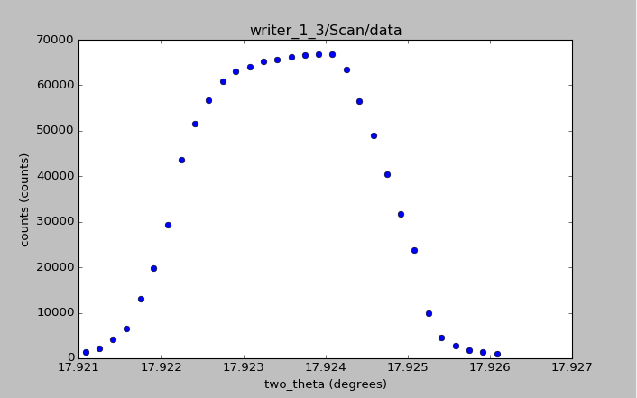

# APS_2016Python_lecture_5
Python code and resources used in APS 2016 Python lecture 5

Goal: print peak position, center of mass, and full-width at half maximum for a scan in an HDF5 data file

The data file chosen for this example is from the [NeXus manual](http://download.nexusformat.org/doc/html/examples/h5py).
A graph of this data is provided.

The functions to compute the goals have been coded directly
and are placed in a library file with the code.
